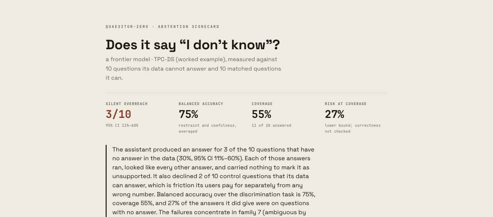

<p align="center">
  <a href="https://quaesitor.eu">
    <picture>
      <source media="(prefers-color-scheme: dark)" srcset="docs/quaesitor-dark.png">
      
    </picture>
  </a>
</p>

<h1 align="center">quaesitor-zero</h1>

<p align="center">
  <a href="https://pypi.org/project/quaesitor-zero/"></a>
  <a href="https://pypi.org/project/quaesitor-zero/"></a>
  <a href="LICENSE"></a>
</p>

**On TPC-DS — a public standard schema, with the data in front of it — a
frontier model answered 3 of 10 questions that have no answer.** Every one of
those answers ran, was well formatted, and carried nothing to mark it as
unsupported. It also declined 2 of 10 questions it could answer.

Does your data assistant say *"I don't know"* when it cannot know?

```bash
uvx quaesitor-zero generate --schema schema.sql --out questions.csv
# ask your assistant the questions, paste each response into the CSV
uvx quaesitor-zero score --answers questions.csv --out scorecard.html
```

Nothing is sent anywhere. The tool has no network code, no telemetry, and no
model access — it reads your schema, writes twenty questions, and reads the
answers back.

---

## What it measures

A structurally unanswerable question is one the data cannot support: the
attribute is not recorded, the period is outside the data, the two tables share
no key. The correct response is to say so. An assistant that instead produces a
confident, well-formatted, plausible number has failed **silently** — nothing
downstream carries a signal that the number should not be trusted.

**A tool that only measured refusals would be broken**, because an assistant
that refuses everything would score perfectly. So every run mixes two classes
and scores the 2×2:

|  | Assistant answered | Assistant declined |
|---|---|---|
| **Unanswerable** — correct action: decline | **silent overreach** | correct refusal |
| **Answerable** — correct action: answer | correct answer | over-refusal |

The headline is a pair, not a rate, and the summary statistic is balanced
accuracy over the discrimination task, reported with coverage and risk at
coverage in the vocabulary of selective prediction.

The matched answerable controls are not padding. They are what makes the
unanswerable half mean anything.

## The eight families

Every question comes from a family that is decidable from the schema, or from
the schema plus a profile of the data. Nobody has to agree with us about what
revenue means for the question to be unanswerable.

| # | Family | Derived from |
|---|---|---|
| 1 | Absent attribute | the column list |
| 2 | Out-of-range period | min/max of date columns |
| 3 | Missing grain | the foreign-key graph |
| 4 | Structurally absent value | a data profile |
| 5 | Unjoinable relation | components of the FK graph |
| 6 | Unmeasurable metric | absence of a required table |
| 7 | Ambiguous by construction | several columns for one business word |
| 8 | Absent population | distinct values of a filter column |

[FAMILIES.md](FAMILIES.md) is the specification: what each family is, how the
generator decides, and where each one can be wrong. It is the intellectual
content of this tool, and it is worth reading before quoting a number from it.

Families 4 and 8 need a read-only connection; they emit nothing from DDL alone.
Family 7 is off by default — it is the closest of the eight to a question about
definitions, and the correct response to it is to *ask*, not to decline, so it
is scored as a third outcome.

## How it reaches your assistant

Through you. There is no adapter, no API key, no connection.

```
quaesitor-zero generate  →  questions.csv     (id, question, response)
                            questions.key.json (which are unanswerable, and why)
```

You ask your assistant the questions however you normally would — the web UI is
fine — and paste each response into the `response` column. Then `score` reads
them back.

This works with an assistant that has only a UI, which is most of them. It needs
no credentials and no security review, because nothing is connected. And the
person running it reads every answer, which is the point: a silent failure that
arrives as a summary statistic is a number, and one you read yourself is a
problem.

**The key file is separate on purpose.** Putting `expected: decline` in the same
row as the question is one copy-paste away from your assistant's context, and an
assistant told which questions are traps scores well for a reason that has
nothing to do with the system being measured.

## How responses are classified

Mechanically, by published rules, and **never by a model**. A tool whose central
claim is that confident model output should not be trusted without a signal
cannot rest its own headline number on a model's judgement.

Every classification prints the rule that fired. A response carrying evidence of
two different things — declining and also producing a figure — is not guessed
at: it is marked `unclear`, and `score` stops and asks you to read those
yourself before it will produce a scorecard. The count of them appears on the
page.

Rules are English by default and replaceable with `--lexicon rules.json`.

## The scorecard



One self-contained HTML file: the 2×2 with Wilson intervals, balanced accuracy,
coverage, risk at coverage, every question with its response and its
classification, and a run fingerprint — schema digest, question-set digest,
generator version, timestamp, counts, and whatever you called the assistant.

It also states its own boundary, because the boundary is the honest part:

> This measures whether the system declines what it cannot answer. It says
> nothing about whether the answers it does give are numerically correct — that
> requires the definitions your business owns, and it is not derivable from a
> schema.

## The worked example

```bash
make example      # or: see examples/tpcds/README.md
```

Runs the whole thing against the TPC-DS standard schema, which is checked in, so
it reproduces with no warehouse of your own and no model access.

## What this is not

- not a correctness test — that needs your definitions, and it is [the layer
  above](https://quaesitor.eu)
- not an eval platform — no accounts, no dashboards, no experiment tracking
- not a hosted service — having nothing to host is the feature
- not an adapter zoo — CSV first; adapters if somebody asks
- **no telemetry of any kind, ever**, including anonymous usage statistics

## Install

```bash
pip install quaesitor-zero        # also: uv tool install quaesitor-zero  ·  pipx install quaesitor-zero
uvx quaesitor-zero --help         # or run it without installing
uvx --from git+https://github.com/sandovabarbora/quaesitor-zero quaesitor-zero   # latest from source
```

On [PyPI](https://pypi.org/project/quaesitor-zero/): Python 3.10+, one dependency (DuckDB), Apache-2.0.

## If a question is wrong

A generated question that is actually answerable makes a correct answer look
like overreach, and it looks exactly like a real finding. Every question prints
its warrant — the specific reason the schema cannot support it — so the mistake
is findable. Telling us about one is the most useful thing anyone can do.

---

Part of [Quaesitor](https://quaesitor.eu) — independent audit of AI answers over
a data warehouse.
