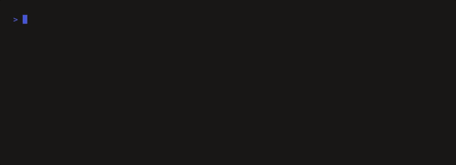

<p align="center">
  <a href="https://quaesitor.eu">
    <picture>
      <source media="(prefers-color-scheme: dark)" srcset="docs/quaesitor-dark.png">
      
    </picture>
  </a>
</p>

<h1 align="center">quaesitor-zero</h1>

<p align="center">
  Does your data assistant say &ldquo;I don&rsquo;t know&rdquo; when it cannot know?
</p>

<p align="center">
  <a href="https://pypi.org/project/quaesitor-zero/"></a>
  <a href="LICENSE"></a>
</p>

<p align="center">
  
</p>

```bash
uvx quaesitor-zero demo                    # a real scorecard, no setup

uvx quaesitor-zero generate --schema schema.sql --out questions.csv
#   ask your assistant the questions, paste each reply into the CSV
uvx quaesitor-zero score --answers questions.csv --out scorecard.html
```

**→ [HOWTO.md](HOWTO.md)** walks it end to end: getting the DDL out of your
database, what to paste where, and the review step that stops the scorer.

---

## Why the pair, and not a rate

It writes questions your data **cannot** answer, and a matched set it **can**.
An assistant that refuses everything would ace the first half, so the finding is
always both:

|  | Assistant answered | Assistant declined |
|---|---|---|
| **Unanswerable** | **silent overreach** | correct refusal |
| **Answerable** | correct answer | over-refusal |

A silent overreach is a confident, well-formatted, plausible number for a
question the data cannot support. Nothing downstream marks it as unsupported,
which is why counting only refusals misses it.

On TPC-DS, a public standard schema, a frontier model **answered 3 of 10
questions that have no answer** and **declined 2 of 10 questions it could
answer**.

The scorecard is one self-contained file: every question and reply, the rule
that classified it, Wilson intervals, and a fingerprint of the run. It states
its own boundary, which is the honest part:

> This measures whether the system declines what it cannot answer. It says
> nothing about whether the answers it does give are numerically correct.

That second half is what a [Quaesitor audit](https://quaesitor.eu) measures.

## What it means by "cannot answer"

Not an opinion, and not a model's. Every question carries a warrant: the
specific fact about the schema that makes it unanswerable. Three from the
shipped TPC-DS example:

**out-of-range period** &nbsp;·&nbsp; *What was the total quantity in Q3 2003?*  
No fact table reaches past 2003-05-02 through date_dim.d_date, so Q3 2003 is outside the data by one quarter for every table that could answer it.

**absent attribute** &nbsp;·&nbsp; *What is the total carbon footprint of our item records?*  
No table or column name matches any of carbon, co2, emission, emissions, footprint, so the attribute is not recorded.

**ambiguous by construction** &nbsp;·&nbsp; *What was our total cost in 1999?*  
13 columns could be meant (catalog_returns.cr_return_ship_cost, catalog_sales.cs_ext_ship_cost, catalog_sales.cs_ext_wholesale_cost, catalog_sales.cs_wholesale_cost, item.i_wholesale_cost, promotion.p_cost), and the question gives no way to choose. Asking which is correct; picking one silently is the failure.

Eight families produce these, each decidable from the schema or from a profile
of the data. Nobody has to agree with us about what *revenue* means for the
question to have no answer. **[FAMILIES.md](FAMILIES.md)** is the
specification, including where each family can be wrong.

Replies are classified **mechanically, never by a model** — a tool arguing that
confident output needs a signal cannot rest its own number on a model's
judgement. Every classification prints the rule that fired, and anything
carrying evidence of two things is handed to a person rather than guessed at.

## Install

```bash
uvx quaesitor-zero --help        # or: pip install quaesitor-zero
```

Python 3.10+, one dependency (DuckDB), Apache-2.0.

**Nothing is sent anywhere.** No network code, no model access, and no telemetry
of any kind ever, including anonymous usage statistics.

## If a question is wrong

A generated question that is actually answerable makes a correct answer look
like overreach, and it looks exactly like a real finding. Every question carries
its warrant, the specific reason the schema cannot support it, so the mistake is
findable. Telling us about one is the most useful thing anyone can do.

---

<p align="center">
  Part of <a href="https://quaesitor.eu">Quaesitor</a> · independent review of AI answers over a data warehouse
</p>
